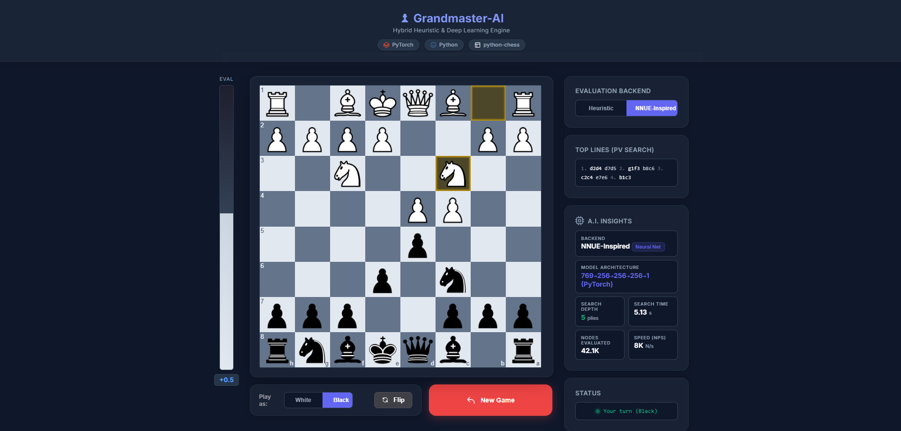
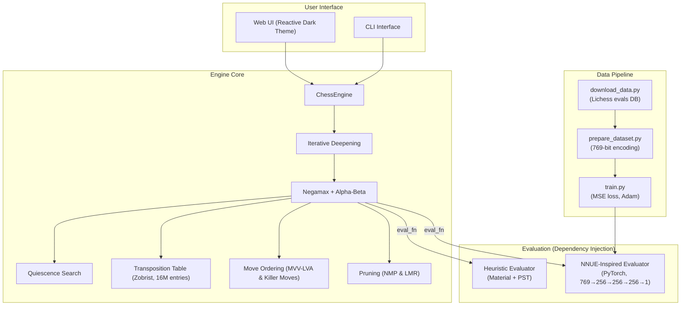

# ♟ Grandmaster-AI

A **hybrid chess engine** built from scratch in Python, featuring both a hand-crafted heuristic evaluator and a PyTorch-based NNUE-Inspired neural network evaluator. The engine uses advanced search techniques including Negamax with Alpha-Beta pruning, Transposition Tables, Quiescence Search, Iterative Deepening, Null Move Pruning (NMP), Late Move Reductions (LMR), and MVV-LVA move ordering.



---

## 🎯 Motivation

Developed as an portfolio project before starting my 3rd year of Computer Engineering, this project explores how modern chess engines work by building one layer by layer:

1. **Board representation** — wrapping `python-chess` for a clean API.
2. **Hand-crafted evaluation** — material counting + piece-square tables.
3. **Data pipeline** — downloading 300K+ positions from Lichess's open evaluation database.
4. **Neural network training** — a custom feedforward PyTorch model trained on Stockfish evaluations.
5. **Search optimizations** — Negamax, Alpha-Beta, TT, Quiescence, NMP, LMR, MVV-LVA.
6. **Reactive Web UI** — a dark-themed Flask interface with real-time evaluation display and A.I. insights.

The goal is an educational, self-contained codebase that demonstrates the full pipeline from raw data to a playable, highly optimized engine.

---

## 🏗️ Architecture


## ⚡ Key Features

| Feature | Description |
|---------|-------------|
| **Negamax + Alpha-Beta** | Single-path search with aggressive pruning |
| **Transposition Table** | 2^24 (~16M) entries Zobrist hash table utilizing ~1.2 GB RAM to cache positions |
| **Quiescence Search** | Extends search beyond horizon for captures; searches all moves when in check |
| **Null Move Pruning (NMP)** | Drastically reduces search space by passing a turn in extremely good positions |
| **Late Move Reductions (LMR)** | Reduces search depth for unpromising quiet moves |
| **MVV-LVA & Killer Moves** | Most Valuable Victim – Least Valuable Attacker prioritization and quiet move sorting |
| **Low-Latency PyTorch Inference** | NNUE evaluation optimized for tree search using CPU-only execution, zero-copy memory sharing, and gradient-free (`@torch.no_grad()`) inference to eliminate GPU latency bottlenecks |
| **Web UI** | Glassmorphism design with live evaluation bar, Top Lines (PV) history, and real-time A.I. insights |
| **Stockfish Benchmark** | Tournament script against calibrated Stockfish for Elo estimation |

---

## 📦 Installation

### Prerequisites
- Python 3.10+
- CUDA-enabled GPU (Highly Recommended for **training** the NNUE model, but inference is purely CPU-optimized)
- 32 GB RAM (Recommended for large Transposition Tables)
- [Stockfish](https://stockfishchess.org/download/) (optional, for Elo benchmarking)

### Setup

```bash
# Clone the repository
git clone [https://github.com/EmreErdogan09/Grandmaster-AI.git](https://github.com/EmreErdogan09/Grandmaster-AI.git)
cd Grandmaster-AI

# Install dependencies
pip install -r requirements.txt
```

### Training the Neural Network (Optional)

The pre-trained model is included at `models/eval_net.pt`. To retrain from scratch:

```bash
# Download Lichess evaluation data (~300K positions)
python data/download_data.py

# Prepare training dataset (769-bit piece-square encoding)
python data/prepare_dataset.py

# Train the neural network
python training/train.py
```

---

## 🚀 Usage

### Web UI (Recommended)

```bash
python ui/web_app.py
```

Open your browser at `http://localhost:5000`. Features:
- Drag and drop pieces to make moves
- Toggle between **Heuristic** and **NNUE-Inspired** evaluation backends
- Real-time **evaluation bar** showing positional advantage
- **A.I. Insights panel** showing search depth, NPS, and computation time

### CLI Interface

```bash
# Play with heuristic evaluation
python ui/play_cli.py

# Play with neural network evaluation
python ui/play_cli.py --nn
```

### Stockfish Elo Benchmark

Requires Stockfish to be installed and available in PATH.

```bash
python tools/play_stockfish.py
```

This runs a tournament against Stockfish at `UCI_Elo = 1320` with a time limit of **1.0 seconds per move** for both engines. It tests both the Heuristic and NNUE-Inspired backends separately and reports win/draw/loss statistics with a rough Elo estimate.

### Search Benchmark

```bash
python tools/benchmark_search.py
```

Measures nodes searched at fixed depths and maximum depth reached within time limits.

---

## 🧪 Testing

```bash
pytest tests/ -v
```

The test suite includes:
- Board representation tests (FEN, PGN, legal moves, special moves)
- Search tests (mate-in-1, mate-in-2, mate prevention)
- Black-side tactic verification (side-relative eval correctness)
- NN evaluation integration tests

---

## 📊 Results

### Board Encoding
Each position is encoded as a **769-bit** feature vector:
- 768 bits: 12 piece types × 64 squares (piece-square encoding)
- 1 bit: side to move

### Neural Network Architecture
```text
Input (769) → Linear(256) → ReLU → Linear(256) → ReLU → Linear(256) → ReLU → Linear(1) → Tanh
```
- Output normalized to [-1, 1] via `tanh(cp / 400)`
- Trained on ~300K Lichess positions with Stockfish evaluations
- Loss: MSE, Optimizer: Adam, Best validation loss: ~0.12

### Search Performance
The combination of NMP, LMR, Transposition Tables, and MVV-LVA move ordering allows the engine to consistently reach **6+ plies depth** averaging **18,000+ Nodes/sec** within a strict 1-second time limit per move.

---

## 🔮 Future Work

- **Self-Play Reinforcement Learning** — use the engine to generate training games and iteratively improve the NN evaluation through self-play.
- **Lichess Bot API Integration** — deploy the engine as a playable bot on [Lichess](https://lichess.org/api#tag/Bot).
- **Opening Book** — integrate a Polyglot opening book for stronger opening play.
- **Endgame Tablebases** — add Syzygy tablebase probing for perfect endgame play.

---

## 📂 Project Structure

```text
Grandmaster-AI/
├── engine/
│   ├── board.py            # Board representation (python-chess wrapper)
│   ├── evaluate.py         # Hand-crafted heuristic evaluation
│   ├── search.py           # Negamax, quiescence, move ordering, NMP, LMR
│   ├── engine.py           # Main engine with iterative deepening
│   ├── nnue_eval.py        # NNUE-Inspired PyTorch evaluation wrapper (CPU-optimized, zero-copy)
│   └── transposition.py    # Fixed-size transposition table (16M entries)
├── training/
│   ├── model.py            # ChessEvalNet architecture definition
│   └── train.py            # Training loop with validation
├── data/
│   ├── download_data.py    # Lichess evaluation database downloader
│   └── prepare_dataset.py  # Dataset preparation (769-bit encoding)
├── ui/
│   ├── web_app.py          # Flask web server
│   ├── templates/
│   │   └── index.html      # Web UI (chessboard.js + eval bar)
│   └── play_cli.py         # CLI interface
├── tools/
│   ├── play_stockfish.py   # Stockfish Elo benchmark
│   ├── benchmark_search.py # Search performance benchmark
│   └── compare_evals.py    # Heuristic vs NN comparison
├── tests/
│   ├── test_board.py       # Board representation tests
│   └── test_search.py      # Search and engine tests
├── models/
│   └── eval_net.pt         # Pre-trained neural network weights
├── docs/
│   └── web_ui_screenshot.png
├── requirements.txt
└── README.md
```

---

## 📝 License

This project is open source and available under the [MIT License](LICENSE).
